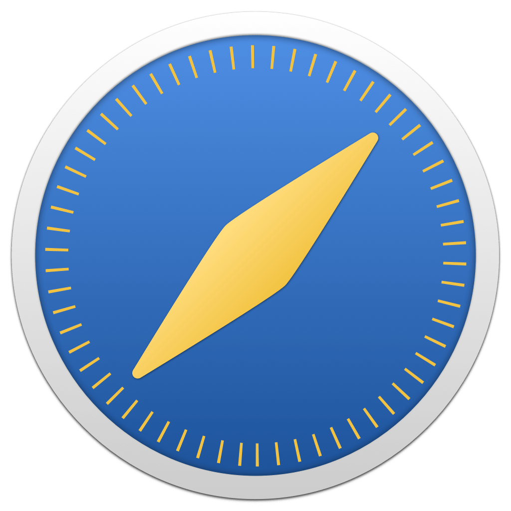

<p align="center">
    
</p>

<p align="center">
    
    
    
    <a href="https://danielsaidi.github.io/WebViewKit"></a>
    <a href="https://github.com/danielsaidi/WebViewKit/blob/master/LICENSE"></a>
    <a href="https://github.com/sponsors/danielsaidi"></a>
</p>


# WebViewKit

WebViewKit is a SwiftUI library that adds a `WebView` and a `SafariWebView` that can present web sites in any app:

<p align="center">
    
</p>

The ``WebView`` component supports iOS, macOS, & visionOS, and can be configured to fit your needs, while the iOS exclusive ``SafariWebView`` can be used for more basic needs and a more browser-like experience.


## ‼️ Important Information

WWDC 25 introduced a native `WebView` component for iOS, macOS, and visionOS, as described [in this blog post](https://danielsaidi.com/blog/2025/06/10/webview-is-finally-coming-to-swiftui). 

With this addition, this package is no longer needed. It will remain a public archive until iOS 27, then be removed.


## Installation

WebViewKit can be installed with the Swift Package Manager:

```
https://github.com/danielsaidi/WebViewKit.git
```


## Support My Work

You can [become a sponsor][Sponsors] to help me dedicate more time on my various [open-source tools][OpenSource]. Every contribution, no matter the size, makes a real difference in keeping these tools free and actively developed.


## Getting started

The library's main view is ``WebView``, which can be used to display any URL:

```swift
import SwiftUI
import WebViewKit

struct MyView {

    var body: some View {
        WebView(urlString: "https://danielsaidi.com")
    }
}
```

See the online [getting started guide][Getting-Started] for more information.


## Documentation

The online [documentation][Documentation] has more information, articles, code examples, etc.


## Demo Application

The `Demo` folder has an app that lets you explore the library and try out the views.


## Contact

Feel free to reach out if you have questions, or want to contribute in any way:

* Website: [danielsaidi.com][Website]
* E-mail: [daniel.saidi@gmail.com][Email]
* Bluesky: [@danielsaidi@bsky.social][Bluesky]
* Mastodon: [@danielsaidi@mastodon.social][Mastodon]


## License

WebViewKit is available under the MIT license. See the [LICENSE][License] file for more info.


[Email]: mailto:daniel.saidi@gmail.com
[Website]: https://danielsaidi.com
[GitHub]: https://github.com/danielsaidi
[OpenSource]: https://danielsaidi.com/opensource
[Sponsors]: https://github.com/sponsors/danielsaidi

[Bluesky]: https://bsky.app/profile/danielsaidi.bsky.social
[Mastodon]: https://mastodon.social/@danielsaidi
[Twitter]: https://twitter.com/danielsaidi

[Documentation]: https://danielsaidi.github.io/WebViewKit
[Getting-Started]: https://danielsaidi.github.io/WebViewKit/documentation/webviewkit/getting-started
[License]: https://github.com/danielsaidi/WebViewKit/blob/master/LICENSE
